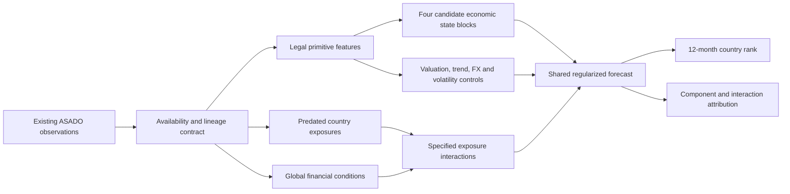

# MacroState — research verdict and final plan

**Date:** 2026-09-06 (data audit captured 2026-09-05)  
**Status:** Research design, not an implementation PRD, fitted model, or alpha claim.  
**Scope agreed with Arjun:** Existing ASADO factors and data only; monthly country selection and weighting; 12-month USD total-return ranking primary, 6/3 months secondary. No new feeds, subscriptions, predictive screens, backtests, or production changes in this assignment.

## 1. Decision

**Proceed with a bounded test of economic representation and conditional transmission. Do not commit to the full hierarchy or a neural architecture.**

ASADO has enough economic breadth to investigate the idea without acquiring another dataset. The unresolved question is not whether another interesting indicator exists. It is whether the existing information, assembled as it could have been known, gains predictive usefulness from an economic representation.

The strongest formulation is:

> Given the same historically available information, can a shared model that groups related measurements and allows a few economically specified conditional effects rank country markets more reliably than a well-regularized flat model?

There are three distinct hypotheses, and they should receive separate verdicts:

1. **Compression:** economic grouping reduces estimation noise without losing useful differences between primitives.
2. **Conditionality:** the meaning of a state for returns depends on valuation, market behavior, another state, or a country's exposure.
3. **Heterogeneity:** some slopes differ persistently across macro identities, and partial pooling improves on both fully shared and separate estimates.

Failure of one is not logically failure of the other two. Conversely, a successful exposure interaction does not prove that five layers of compression or country embeddings help.

The recommended first model is deliberately modest: **four candidate state blocks, a common market-information baseline, and a small frozen interaction slate.** The four blocks are growth expectations, inflation pressure, policy impulse, and financial stress. Credit, external balance sheets, banking, backstops, flows, institutions, and networks remain mapped research extensions. Their admission depends on the actual existing histories, not on collecting more data.

**Evidence standard after independent review:** treat the initial historical comparison as development evidence by default. Ninety-six overlapping annual forecast dates do not automatically support reliable familywise tail inference. Before any confirmatory claim, the evaluator must establish inferential feasibility for the actual admitted sample; otherwise report effect sizes, stability and uncertainty without a superiority verdict. See the [Sakana debate resolution](DEBATE_RESOLUTION.md).

## 2. What the inspiration supports—and what it leaves open

The [Macrosynergy gold article](https://macrosynergy.com/research/gold-and-macro-factors/) combines ten concepts into three equally weighted themes and then a support score. It studies gold futures over 1996–August 2026, principally at monthly and quarterly horizons. That supports investigating economic grouping; it does not establish 12-month international-equity ranking, learned country transmission, or neural-model superiority. Equal weights reduce weight-fitting choices but do not eliminate choices about components, signs, thresholds, or sample selection.

The [associated notebook](https://macrosynergy.com/academy/notebooks/gold-and-macro-factors/) deserves independent scrutiny: it constructs an early inflation-target path rather than observing it, and its relative gold/equity strategy uses weekly rebalancing. The article describes that strategy by referring to the earlier simulation rules. We should therefore transfer the research question, not assume every implementation detail is a certified template. No JPMaQS data were downloaded or proposed for acquisition.

The wider literature is mixed rather than a mandate for either optimism or rejection:

| Evidence | Relevance to MacroState | Boundary |
|---|---|---|
| [Hjalmarsson, Predicting Global Stock Returns](https://www.federalreserve.gov/pubs/ifdp/2008/933/ifdp933.htm) | Finds benefits from pooled forecasting and stronger international evidence for interest-rate variables than valuation ratios; also identifies biased conventional panel inference. | Its long-history monthly premium forecasts do not demonstrate our annual cross-sectional objective. Pooling is a useful bias–variance tradeoff, not proof of identical country slopes. |
| [Popescu, Essays in Asset Pricing and Auctions, chapter 1](https://research.tilburguniversity.edu/en/publications/essays-in-asset-pricing-and-auctions) | A close country-index forecasting precedent comparing macro information, dimension reduction, and nonlinear models. | See [the independent source audit](LITERATURE_CHECK.md) for its exact sample, methods, and unresolved transfer assumptions. Do not borrow its performance as an expected ASADO result. |
| [Goyal, Welch and Zafirov, 2024](https://academic.oup.com/rfs/article/37/11/3490/7749383) | Many published equity-premium predictors weaken in extended or out-of-sample evaluation. Economic stories alone are inadequate. | The paper studies broad U.S. time-series premium prediction and explicitly excludes cross-sectional forecasting. It is an adverse prior, not a refutation of this design. |
| [Kelly, Malamud and Zhou, The Virtue of Complexity](https://www.nber.org/papers/w30217) | Challenges the claim that fewer parameters must always forecast better. | Complexity should remain eligible for a controlled contest. The result does not certify our dataset or justify an unrestricted architecture search. |
| [Rapach, Strauss and Zhou, 2013](https://onlinelibrary.wiley.com/doi/10.1111/jofi.12041) | International monthly return lead–lag evidence makes a strong price-information comparison necessary. | Lagged U.S. returns broadcast as an identical additive input cannot alone rank countries; differential sensitivities are necessary. Historical monthly diffusion does not guarantee a present annual edge. |
| [Miranda-Agrippino and Rey, The Global Financial Cycle](https://www.nber.org/papers/w29327) | Supports examining global financial conditions and heterogeneous international transmission. | Explaining contemporaneous macro/asset co-movement is different from forecasting subsequent relative equity returns. |
| [Drehmann, Borio and Tsatsaronis, BIS 380](https://www.bis.org/publ/work380.htm) | Credit and property cycles differ from ordinary business cycles; credit expansion and accumulated fragility should not be collapsed indiscriminately. | Financial-crisis association is not direct country-equity ranking evidence. |
| [Ghysels, Horan and Moench, NY Fed 581](https://www.newyorkfed.org/research/staff_reports/sr581.html) | Documents how revisions can account for substantial apparent macro predictability. | This is Treasury-return research, used here to motivate a data control rather than claim the same magnitude for equities. |
| [Macrosynergy, systematic stock selection](https://macrosynergy.com/research/systematic-stock-selection-with-macro-factors/) | A closer practitioner example of shared economic inputs with different return sensitivities. | Its 22 long-lived U.S. stocks are not country indices. Selecting continuously surviving stocks using current capitalization is not proof of freedom from survivorship bias, regardless of the article's wording. |

**Literature verdict:** there is enough precedent to justify a falsifiable test, but no source reviewed settles whether ASADO's proposed concept hierarchy beats information-equivalent alternatives. That is the experiment, not an assumption.

## 3. The debate: keep, change, and reject

### 3.1 The strongest case for the idea

Economic measurements are noisy and redundant. A model given ten versions of credit stress and two versions of growth can implicitly overweight credit simply because the warehouse has more credit fields. Grouping can make the effective prior explicit. Country pooling can reduce the variance of estimated relationships. Predetermined exposures can distinguish a common shock's consequences without fitting an independent model for each market.

Interpretability also has research value: component diagnostics can reveal sign errors, source substitutions, duplicated macro observations, and stale inputs. That is a reason to retain transparent definitions even if a flat model ultimately wins.

### 3.2 The strongest case against it

A coherent economic state need not forecast returns. Prices may already incorporate the state; risk premia may rise precisely when the economy deteriorates; listed companies may sell abroad; and policy easing may indicate worsening conditions. A better account of the economy can therefore be a worse ranking signal.

Compression can destroy the disagreement that is informative. Stable inflation with worsening growth is not equivalent to the reverse, even if a composite averages to the same number. Multiple levels of re-scaling and averaging also embed additional weights and nonlinearities. A concept hierarchy can hide researcher discretion instead of reducing it.

These objections require tests, not abandonment. They favor a small, auditable first representation, preservation of component residuals, and a strong primitive benchmark.

### 3.3 A fixed linear concept adds no information

If the legal primitive matrix is `X` and a fixed concept map is `A`, then `C = X A`. A linear model on `X` and `C` has exactly the same fitted-function class as a linear model on `X` alone. An improvement can arise because the parameterization changes the penalty, not because the concept created information.

For equally penalized coefficients in `X b + X A g`, the effective primitive coefficient is `theta = b + A g`; minimizing `||b||² + ||g||²` at fixed `theta` produces the penalty `theta' (I + A A')^-1 theta`. This gives an exact **structured-ridge control** when the concept transformation is fixed and linear. Fold-specific feature scaling must be included in `A` for this identity to apply.

Row-varying missingness, clipping, ranks, nonlinear transforms, or changing normalization make the fixed-`A` identity incomplete. Such effects must be named and exposed equally to the comparison model. Never report an `X+C` win as proof of new macro information.

### 3.4 Separate economic direction from return direction

Each primitive needs an economic sign: higher inflation, stronger growth, tighter policy, greater stress. The return coefficient is a different object. The primary additive learner may estimate either return sign with shrinkage. A signed equal-weight economic score is not automatically a signed equal-weight return forecast.

Growth levels, growth revisions, and growth surprises answer different questions. Policy-rate levels, changes, and unexpected changes also differ. Use exact names. Do not call an observed rate change a monetary-policy shock without an identification argument.

### 3.5 Do not require marginal success before interactions

A variable may matter only when another variable is extreme. ASADO's prior [Boundaries work](PRIOR_RESEARCH.md) gives a concrete development-sample example: weak standalone CAPE extremeness accompanied a stronger momentum interaction. It is not confirmed MacroState evidence, but it invalidates the seed's universal standalone-pass prerequisite.

Register a finite interaction slate before inspecting return outcomes. Run it even if its component main effects are weak. Include those main effects for interpretation, but do not force their coefficients to be nonzero. If both additive and the frozen interaction routes fail, stop; do not search all pairs and triples until one passes.

### 3.6 Continuous states, not another regime taxonomy

Use continuous measurements initially. Named regimes, HMM states, archetypal historical analogs, and learned clusters would add thresholds, instability, and scarce regime samples. Existing ASADO failures make them poor launch choices. Words such as “cheap and improving” should describe a continuous, defined interaction, not introduce a new discretionary regime label.

### 3.7 Country economy is not country equity market

ChinaA and ChinaH, and U.S./NASDAQ/US SmallCap, share national macro information but have different equity composition and pricing. Keep separate market tokens and market-state features while sharing a macro identity. National commodity or trade exposure is a transmission hypothesis, not an observed equity-index revenue exposure.

If historical sector/revenue exposure is not already available and legal in ASADO, do not acquire it or back-project today's weights. Instead report this omitted-mechanism limitation and test whether predetermined national exposures outperform a simple training-only market sensitivity.

### 3.8 A global state needs a differential channel

In a shared additive rank model, adding the same `gamma * global_state_t` to every country leaves ordering unchanged. A global series earns a role through `global_state × exposure`, or by modifying a local-state slope. This is an algebraic property of the ranking objective, not a general claim that global macro does not matter.

### 3.9 Replace “stress divided by backstop”

A standardized capacity score can be zero or negative, making division unstable or meaningless. Keep stress and capacity separate; test a bounded interaction such as `positive_stress × low_capacity`. A larger central-bank balance sheet can reflect a crisis response rather than greater remaining capacity. Foreign reserves need an economically meaningful denominator and currency context. Avoid one universal backstop score until the components have a defensible interpretation.

### 3.10 Do not make complexity earn an impossible prerequisite

Simple models are the starting comparison, not the definition of truth. A bounded nonlinear contest is allowed after data and evaluator gates even if the additive model has weak marginal results. Complexity must beat a fair control on held-out observations; it need not prove that every building block was independently predictive first. Large neural, temporal, and graph programs remain outside the first contest.

## 4. Representation to investigate

The diagram describes candidate predictive organization. Its arrows are not an identified causal graph: markets, macro conditions, and policy respond to one another.

### All seed concepts receive a disposition

| Seed concept | Proposed role | What must remain distinct | Launch decision |
|---|---|---|---|
| Growth cycle | Core growth expectations/activity block | Level, revision, realized surprise | Prefer existing dated consensus paths; use local release data only for the actual releasing country. |
| Monetary policy impulse | Core policy block | Policy moves, market-priced front end, expected policy | Use exact existing price/rate definitions; no fabricated surprise. |
| Real tightness / policy-growth mismatch | Derived interaction | Ex-ante expected inflation versus realized inflation; tightness versus weak growth | Do not average into policy before testing. Admit only if both component histories qualify. |
| Inflation regime | Core inflation block | Expected level, revision, surprise | A high score means inflation pressure, not mechanically bearish equities. |
| Private credit cycle | Later credit block / slow modifier | Credit expansion versus leverage burden | No blind carry of revised credit gaps into headline training. |
| External vulnerability | Slow exposure/modifier | Funding requirement, reserve adequacy, FX debt, observed FX stress | Keep structural vulnerability separate from market-priced stress. |
| Sovereign / fiscal stress | Market-priced stress at launch; fiscal extension later | CDS/rates versus fiscal quantity and currency denomination | Avoid comparing nominal yields as pure sovereign risk across countries. |
| Banking fragility | Later vulnerability modifier | Capital/liquidity levels versus deterioration | Sparse/revised supervisory histories may remain conditional-replay only. |
| Policy backstop | Later interaction modifier | Capacity versus realized intervention | No stress/capacity division or universal CB-balance-sheet sign. |
| Capital flows / positioning | Optional separate block | Creation/redemption impulse versus positioning stock | Coverage and zero/stale classifications matter; no renaming ETF flows as all foreign flows. |
| Global risk / doom | Global conditioning vector | Price stress versus survey/news pessimism | No additive broadcast pretending to create cross-sectional variation. |
| Terms of trade / commodity impulse | Predetermined exposure interaction | National trade exposure versus listed-market exposure | Use historical exposure only if existing availability/lineage qualifies. |
| Valuation | Common market baseline | Own-history valuation versus peer cheapness | Always present in the benchmark; not counted as novel macro information. |
| Market trend / fragility | Common market baseline | Trailing returns versus forbidden forward targets | Start with simple momentum/volatility; do not revive killed fragility composites. |
| Institutions / domestic capital / demographics | Slow priors, later sensitivity | Observed vintage versus future projection | Not monthly timing inputs by default; omit unproved history. |
| Network vulnerability | Deferred exposure experiment | Predated reference weights versus authentic release vintages | No graph neural network, current-edge history, or trained combiner as raw input. |

### Initial construction contract

- Aim for roughly **12–24 distinct primitives**, not 50–80 by quota. Count underlying economic measurements, not source aliases, normalized copies, or multiple return windows. The catalog determines the final list before predictive evaluation.
- Keep the four state blocks as separate columns. No compulsory higher-level meta-state and no one-dimensional “good economy” score. Meta-states can be presentation summaries after a useful forecast exists.
- For each eligible measurement, choose one primary source based on provenance, units, coverage, and freshness—not predictive performance. Record secondary-source discrepancies. Do not splice sources across history without a dated, versioned rule.
- Use one primary historical normalization: past-only robust centering/scaling, 60 monthly observations with at least 36 valid past observations, bounded at ±3. This is a proposed engineering convention, not an optimized result. Natural economic neutral values take precedence where genuinely documented; no invented inflation targets.
- Peer-relative ranks are a **different feature definition**, admitted only for concepts whose economic mechanism needs relative levels (not automatically duplicated for every primitive). Cross-sectional statistics use eligible macro identities so multiple U.S. sleeves do not multiply a national observation.
- Preserve levels and changes separately when both have a mechanism. Use one fixed change horizon initially, ordinarily three months for forecast revisions and policy moves. No all-horizons Cartesian product.
- Average the normalized, economically signed components within each concept. Give distinct measurements equal weight; duplicate source versions get no extra votes. Do not repeatedly re-normalize every hierarchy level in the primary recipe.
- Freeze component membership. For a multi-component concept require at least two independent measurements and at least two-thirds of its specified components. A valid singleton is named as a singleton and cannot be described as evidence for compression.
- Retain raw missing values, observation dates, availability evidence, age, and component masks. A model may encode a missing centered feature numerically as zero **with a mask**; this is an estimator convention, never a fabricated observation. All arms receive identical missingness information.
- Do not allow component absence to change the score's definition invisibly. Report weights actually used and run a stable-component sensitivity. A masks/age-only model is an essential control for country and era identification.

## 5. Existing data: broad enough, admission still explicit

The live audit and source-qualified catalog are separate deliverables:

- [Data audit](DATA_AUDIT.md): source coverage, lineage findings, current-versus-stale documentation, feasibility limits.
- [Candidate catalog](candidate_catalog.csv): exact mappings and proposed treatment of candidate primitives.
- [Broad universe inventory](universe_inventory.csv): aggregated existing table/variable/source inventory, including duplicated surfaces and non-feature objects.

The catalog maps 361 concept entries to 339 source-qualified measurements across all sixteen concepts. The saved target check reconciled all 10,181 nonempty annual labels to twelve consecutive monthly returns; this is internal arithmetic validation, not a source-vintage certification. No candidate is yet marked certified for historical ML.

Inventory size is not the number of independent predictors. A derived signal, raw input, normalized variant, and duplicated table row may all refer to the same measurement. Published periods, forecast targets, and release dates are also different clocks.

Use three **research admission labels** alongside the existing repository metadata; these do not silently replace the repository's A/B/C/Q classifications:

| Label | Evidence requirement | Permitted use |
|---|---|---|
| VERIFIED_REPLAY | Existing raw/history artifact, first-available timing, revision treatment, and causal transformations support historical replay; sampled checks and prefix-invariance pass. | Headline matched OOS experiment. A source label or timestamp alone is insufficient. |
| CONDITIONAL_REPLAY | Historical values exist, but one or more release/vintage assumptions remain unproved. | Clearly separated sensitivity results, using the same model and common sample; never merged into the headline claim. |
| NOT_ADMITTED | Forward labels, future projections misused as realized data, current-weight history, circular model outputs, or inadequate provenance. | Catalog/context only. |

This does not require perfect historical data for every seed concept. Admit what is defensible; omit the rest. An imperfect broader sensitivity can measure dependence on assumptions, but cannot establish historical implementability. Existing exports, archives, collector output, and code may resolve gaps without any new source. If they cannot, retain the limitation.

**Important current findings:** the monthly cleaning code has improved since the August ML audit, while source-code repair alone does not prove the stored panel's construction vintage. WEO's nominal vintage date and graph “vintages” require inspection beyond their names. Broad broadcast release tables must be separated into genuine local events and intentionally shared global events. These are concrete admission questions, not a request to expand ASADO.

## 6. Target, universe, and clock

For a forecast made after the preceding month-end information cutoff, let `t` denote the next calendar month. The primary label is:

`R(i,t,12) = product[k=0..11](1 + r_USD_total(i,t+k)) - 1`.

The relative label is that value minus the equal-weight average across markets eligible at the decision date. Ranking the relative label or the total-return label gives the same ordering within a date. An average of 12-month buy-and-hold market returns is not the return of an equal-weight portfolio rebalanced monthly; report the latter separately.

Use the canonical T2 forward label and independently compound the monthly return surface. Require all twelve interior months, correct units, no duplicate market-months, and an explicit label-end/availability date. Do not infer alignment from a name. Targets are stored physically separately from inputs.

The configured 34 current market tokens remain the research universe. Historical eligibility uses only decision-time information. No pre-inception zero padding, future-survival screening, or dropping a suspended/delisted market because its subsequent return is inconvenient. A missing outcome is an unresolved observation, not permission to retrospectively change that month's benchmark.

This remains a study conditional on today's chosen T2 universe unless historical membership is independently established from existing records. It is not a claim about all markets that ever existed.

Group ChinaA/H and the U.S. complex by macro identity for national features, grouped holdouts, and contribution attribution. Primary fit gives each date equal weight and each macro identity equal aggregate weight within a date; that weight is divided between its eligible market sleeves. Also report ordinary market-equal training as a fixed sensitivity. **The investment benchmark stays equal-weight eligible markets**, as agreed; training weights do not redefine it.

Define a global information cutoff after the prior month's relevant market closes and known release timestamps. A close-to-close monthly return is a forecast research target, not automatic evidence that one could trade at that preceding close. The portfolio assessment must use the first available per-market session after that common cutoff. Use the actual available price field: if only daily closes exist, use next-session close and disclose the extra lag; do not invent opening quotes. Otherwise explicitly label the monthly index-return expression as a proxy. Waiting until the agreed monthly decision for a mid-month release is intentional; its earlier reaction is not captured. No new market-data acquisition is needed.

For FX attribution, verify quote direction and use `(1+R_USD) = (1+R_local)(1+R_FX)` only on matched total-return windows. Keep the interaction term; do not subtract percentages and call the remainder exact currency contribution. If existing local/FX histories cannot reconcile, report attribution unavailable while retaining the agreed USD target.

## 7. Fair model contest

All comparisons use the same admitted information, row set, target, fitted preprocessing, inner-validation schedule, and opportunity to tune regularization. Save predictions for every forecast date, including abstentions. Adding an exposure or nonlinear transform creates a new information/representation comparison and must be supplied to the relevant control.

| Arm | Specification | Question answered |
|---|---|---|
| B0 | Equal-weight eligible-market portfolio; zero relative-return prediction | Is there useful ranking at all? A constant score has no rank IC; do not assign it artificial IC=0 observations. |
| B1 | Fixed value-plus-momentum rank baseline; common volatility/FX controls in learned versions | Does MacroState improve on obvious market information? |
| B2 | Pooled ridge on market controls plus the admitted primitive set | Can flat regularized inputs already explain the gain? |
| B3 | Structured/group-penalty primitive ridge | Does concept grouping beat its equivalent or comparable regularization prior? |
| C1 | Pooled concept ridge plus the same market controls | Does compression preserve useful information and improve stability? |
| C2 | Primitive-plus-concept ridge, with the fixed-linear equivalence check | Are residual details useful? Attribute any gain to representation/regularization, not extra information. |
| I1 | C1 plus the frozen interaction slate | Is there incremental conditional information beyond additive state and market effects? |
| I2 | B2 plus the **same explicitly constructed interactions** | Does the hierarchy itself help, beyond simply engineering the interactions? |
| H1 | Best predetermined linear representation with strongly penalized macro-identity slope deviations | Does partial pooling help beyond shared slopes? |
| N1/N2 | One shallow nonlinear learner on primitive inputs versus concept inputs, with equal inputs/masks and matched tuning budget | Does automatic nonlinearity add more than the explicit interactions, and does compression help it? |

Do not run every conceivable model. **First contest:** B0/B1/B2/B3/C1/C2/I1/I2. Heterogeneity and one paired nonlinear contest are the next bounded stage if the question remains empirically viable. Predeclare a follow-on budget of H1 plus one nonlinear representation pair (three arms). If their exact forms are chosen using Stage 3 outcomes, those outcomes are development evidence for them; their claimed improvement needs the later frozen confirmation interval. Reused Stage 3 OOS is not fresh confirmation. A shallow boosted-tree or spline-interaction learner is the first nonlinear comparator; choose and freeze one before results. A small MLP is a subsequent separately charged test, not a launch requirement.

Use regularized squared error on the cross-sectionally centered USD return label as the initial training loss; select hyperparameters on mean validation rank IC. This keeps predicted return units while aligning selection with the agreed ordering objective. Predeclare ridge strengths on a compact log grid (for example six strengths after loss/feature scaling); ties within one validation standard error favor stronger shrinkage. Keep the grid and selection convention identical across the relevant arms. More objectives, lookbacks, clipping choices, or grids are new research choices, not free retries.

For H1, write `beta_identity = beta_shared + u_identity` and shrink `u` toward zero with one shared penalty. Start with deviations on no more than two predeclared state/exposure slopes. Penalized intercepts, when used, must be the same in controls. Do not fit separate country models and then call them shared because they use the same code. An unpooled ridge limit can be a diagnostic comparison; never interpret 34 fits as 34 independent confirmations.

## 8. Interaction slate and economic interpretation

The slate is a proposal to freeze after non-predictive data admission. Unavailable inputs cause an interaction to be marked NOT_TESTABLE; they do not trigger outcome-guided substitutions. Start with no more than four runnable terms. The following priorities are explicit:

1. **Cheap × improving growth expectations.** Positive cheapness and positive fixed-horizon GDP revision, using bounded positive-part functions. Question: is improvement more valuable when valuation leaves room for it? Control against both main effects and against the same engineered term in primitive ridge.
2. **Weak growth × tightening policy/financial conditions.** A downside conditionality hypothesis. Distinguish a rise in market-priced front-end rates from ex-post inflation-driven changes in real rates. Do not mechanically pool these definitions.
3. **Global tightening × external exposure.** Use one existing, defensible, predated exposure. If historical structural exposure is not admitted, mark this structural test unavailable. A training-only market beta can be a separately named statistical-sensitivity comparison, not a substitute claimed to measure FX debt.
4. **Commodity movement × net commodity exposure.** One documented basket/weight definition using existing histories; no current trade shares projected backward. Controls include a neutral/common exposure and a training-only sensitivity estimate.

The next reserved alternative, if a separate trial is justified later, is **valuation × capital-flow inflection**. The three-way “cheap × improving × easing” story is decomposed first into the two-way tests; do not add the triple automatically.

A raw product of signed scores can give the same sign to economically opposite states. For “cheap and improving,” use `max(cheap,0) * max(improving,0)` with bounded inputs, retain main terms, and state the intended quadrant. For a signed global commodity shock and a signed net exposure, an ordinary product is economically meaningful. Different mechanisms warrant different forms; one product template for all concepts is not appropriate.

## 9. Validation, inference, and research accounting

### Temporal evaluation

1. Finalize data recipes and eligibility from metadata/coverage before examining target associations.
2. Use an expanding training window; initial target is 120 **matured monthly training origins**. Predict monthly, refit coefficients annually. Hyperparameters are selected in inner forward-only folds restricted to labels known by that refit date.
3. At every fit, require `label_available_at <= fit_cutoff`. At an inner/outer validation boundary, remove training labels whose full return intervals overlap the evaluation interval. This is a twelve-month maturity/purge discipline, not merely shifting feature dates by twelve rows. Do not add redundant blanket gaps after the interval checks already enforce the requirement.
4. Within each training window require at least 60 matured origins for the first inner training fit and two disjoint forward validation blocks of 24 forecast origins each, with full label-maturity checks at every boundary. Inner validation labels must also be mature by the outer refit. These two blocks still contain only about four non-overlapping annual horizons; report that limitation. The earliest valid evaluation date is determined by an explicit origin/label-end feasibility table, not by subtracting row counts. If this cannot be supported, a separately labeled exploratory track may use a single a-priori fixed penalty shared across arms; it cannot silently claim the tuned confirmatory design passed.
5. Seek at least 96 monthly OOS forecasts, covering more than one economic episode. For a broad-universe claim, target at least 28 market tokens and 25 macro identities on at least 95% of those dates. These are proposed coverage/operational floors, not proof of statistical power. A smaller defensible panel receives a smaller-scope verdict and its own predeclared benchmark.
6. Freeze a final historical confirmation interval by availability and prior-use audit, before examining its MacroState outcomes. Many years have already informed ASADO research, so call it **historical confirmation**, not automatically an untouched lockbox. Any parameter revision after opening it consumes that confirmation set.
7. Freeze the surviving model for future shadow forecasts. Twelve-month labels mature twelve months later; monthly observations do not shorten that wait. No scheduler or production feed is installed by this planning task.

### Inference-feasibility gate

Historical comparison is development evidence by default. Before using confirmatory p-values or superiority/non-inferiority labels, audit the actual number and diversity of independent episodes, block-length sensitivity and interval stability. In evaluator validation, use declared dependence-preserving null simulations and effect-injection power diagnostics for the whole frozen selection procedure. Simulations assess procedure behavior under stated assumptions; they cannot certify that the real process follows those assumptions. A small number of long blocks, unstable tails or inadequate power means descriptive estimates and an INSUFFICIENT_EVIDENCE verdict, regardless of nominal bootstrap significance. Neither 96 forecast dates nor an arbitrary effective-N cutoff is a certificate. No exact scalar effective sample size is asserted.

Where the legal sample cannot support inner folds, use a predeclared fixed penalty in the exploratory track. Generic pooled GCV is not a substitute for respecting serial dependence and the forecast clock. Confirmation remains conditional on this gate; prospective accumulation may be necessary.

### Primary and secondary evidence

The primary statistical endpoint is **paired change in mean date-level 12M Spearman rank IC versus B2 primitive ridge**, assessed on identical predictions/rows. B3 structured ridge is the mandatory strong secondary comparator for any claim about concept grouping. Require an additional identity-level comparison: within each macro identity, average eligible token predictions and realized 12M returns using equal weights fixed by origin eligibility, then compute date-level rank IC across identities. Report the paired B2 comparison and within-identity token contribution separately. This does not replace the agreed primary token objective, but a cross-national transmission claim must survive this check rather than rely on US-style selection alone. Include any formal claim from this endpoint in the frozen multiplicity family. Also report absolute IC, forecast error versus zero-relative/market baseline, IC by year, dispersion, and sample counts. Do not select the comparator retrospectively from pooled OOS outcomes. If a future protocol uses a baseline selector, its choice must be recomputed recursively using only matured inner folds at each outer refit; that is a distinct frozen algorithm. Include all confirmatory candidate–comparator pairs in multiplicity control.

Use paired moving/stationary time-block resampling of **whole cross-sections**, with a primary block length of 24 months and fixed 12/36-month sensitivities. Adjacent annual targets share eleven months, and countries share global shocks. Neither country-month row count nor monthly IC count is an independent annual sample size. Report actual horizon overlap and the small number of long blocks.

Use a familywise maximum-statistic or appropriate stepdown correction at familywise alpha 0.05 over the frozen model/interaction/comparator slate for confirmatory comparisons. A bootstrap interval conditional on a selected winner is not automatically selection-adjusted. Resample the whole selection procedure when making a claim about that procedure; otherwise label intervals conditional on frozen predictions/model selection. Report Newey–West with annual-horizon lags and twelve non-overlapping annual-offset cohorts as diagnostics, not twelve independent replications.

Keep the existing hypothesis/methodology ledger front door and family lineage. Record all specifications, failed attempts, changed normalizations, interaction choices, and nesting grids. The current harness's DSR-like statistic is useful historical bookkeeping but does not by itself provide dependence-adjusted annual-horizon inference. Do not silently replace repository verdict semantics with the plan's research decisions.

### Portfolio relevance without cost gates

Report two fixed, gross portfolio expressions from the same saved predictions:

- **Monthly refreshed selection:** equal-weight top quintile, bottom quintile, long-short spread, and top-quintile excess against the monthly rebalanced eligible equal-weight benchmark. Fix rounding and ties in advance. This is the secondary economic expression. Set portfolio width to `ceil(n_eligible/5)` (seven when n=34), with deterministic canonical-name tie breaking; apply the identical rule to baselines.
- **Twelve-month vintage portfolio (primary economic expression):** begin with twelve equal initial capital sleeves. Each month the maturing sleeve invests its then-current NAV in that month's equal-weight top-quintile selection and holds those names for twelve months with buy-and-hold weight drift. Other vintages are marked to market, not reselected. Show the first-year ramp/cash convention; portfolio evaluation comparisons begin on an identical schedule. Benchmark against twelve identically timed sleeves holding that origin's eligible equal-weight universe, and against B2 top-quintile vintage selection. This avoids confusing a buy-and-hold origin benchmark with monthly rebalanced equal weight. It also avoids killing a delayed annual payoff merely because monthly refreshed selection is weaker.

Never compound overlapping 12M labels as monthly P&L. Show monthly cash-flow/weight arithmetic and reconcile country contributions to total active P&L. Costs and turnover are implementation diagnostics only; they cannot kill or penalize this research under Arjun's current policy.

### Falsification and breadth

- Prefix truncation and injected-future-row tests for observations, transformations, exposures, and learned parameters.
- Future-label/alias/lineage injection must fail closed; all interior return months must exist.
- A masks/age-only baseline; stable-component and stable-coverage comparisons.
- A fixed two-month additional-delay sensitivity, interpreted as timing robustness, not a leakage verdict: genuine decay can reduce performance, while revised data can remain contaminated after delays.
- A predeclared descriptive concept placebo: 100 frozen random maps preserving group sizes and scaling, with identical penalty rules and no winner selection. Similar performance weakens a special economic-grouping claim. Random-map counts and seeds belong in the research record; no formal randomization p-value without a justified null.
- Full nested refits with each concept group removed. Correlated-feature importance alone is not a mechanism test.
- Same engineered interactions on primitives, no-interaction control, and training-only generic exposure control.
- Synchronous time-shift/block placebos that preserve cross-country dependence. Country/exposure permutation is a destructive diagnostic; arbitrary country exchangeability cannot be assumed for formal p-values.
- Macro-identity and market-level active P&L, positive contribution count, top-one/top-three contribution share, and leave-largest-identity-out results. Include U.S.-complex removal and DM/EM results without selecting a winning subgroup afterward.
- Fixed chronological halves and leave-one-major-episode-out sensitivity. Crisis-only concentration is disclosed, not relabeled as broad predictive skill.
- Price-control ablation: distinguish gains from non-price economic information, market-implied stress, and their interaction. Do not silently change the agreed target into factor-residual returns.

## 10. Keep, simplify, stop, or declare insufficient

Thresholds below are **proposed research decisions to freeze before outcomes**, not estimates of achievable performance or universal financial laws. The audit may show insufficient sample, in which case report that explicitly rather than tuning thresholds to obtain a verdict.

| Decision | Required evidence |
|---|---|
| Continue a richer representation | Positive absolute and incremental 12M rank skill, selection-adjusted evidence against no improvement, and positive gross top-quintile active improvement in the primary vintage expression on the paired sample; broad results not overturned by one identity/episode. Freeze the decision as point estimate ΔIC ≥ 0.01 **and a selection-adjusted 95% lower confidence bound above zero**. This establishes statistical superiority over zero improvement, not a guaranteed minimum gain of 0.01; claiming the latter requires the lower bound itself to exceed 0.01. |
| Keep a simpler concept model | The selection-adjusted 95% lower bound for ΔIC exceeds −0.01, with measured improvement in stability/component robustness; a nonsignificant difference or a point estimate inside the margin is not a non-inferiority test; call it efficient compression, not additional alpha. User's overall forecast-success requirement still needs improvement over the market-only baseline. |
| Keep transmission, discard compression | Exposure/conditional terms improve primitive models, but concepts add nothing beyond equivalent regularization. The result is a small interaction strategy, not a hierarchy victory. |
| Simplify to flat model | The primitive model matches or beats concepts, heterogeneity, and nonlinearity on matched information; stop architectural escalation. |
| Reject a branch | Robustly negative or non-incremental performance, disappearance under legal replay/common samples, or dependence on forbidden/late inputs. Record the tested horizon, universe, expression, and exact failed claim. |
| INSUFFICIENT_EVIDENCE | Confidence intervals span both useful improvement and material degradation, or admitted history/coverage cannot identify the primary question. This is different from a demonstrated economic null. |
| No MacroState forecasting success | Only valuation/momentum or missingness drives the gain, or a descriptive state map has no incremental return information. A useful dashboard would require a separately named purpose, not a rewritten success criterion. |

Do not require every country, every year, and every interaction to have the same sign. Heterogeneous transmission predicts some differences. Require those differences to be economically prespecified and the aggregate case to survive concentration checks.

## 11. Staged execution plan and tangible outputs

| Stage | Work | Deliverable | Exit condition |
|---|---|---|---|
| 0 — This assignment | Source debate, live inventory/PIT audit, prior research, independent critique | This plan and linked evidence package | Completed planning; no forecast claim. |
| 1 — Freeze inputs and contract | Select existing primitives; replay evidence; macro identities; target/clock; common-sample feasibility; trial slate | Versioned feature manifest, observation/target/universe snapshots, coverage table, signed experiment specification | Required fields and causal tests pass; otherwise restricted-scope or insufficient-data decision. |
| 2 — Validate evaluator | Label-maturity-aware fitting, nested splits, paired metrics, monthly/vintage portfolio arithmetic, inference-feasibility diagnostics | Deterministic evaluator, canary results and inference limitations | Exact date examples and no-leakage tests pass; reproduce fixed baseline arithmetic; set exploratory versus confirmatory status explicitly. |
| 3 — Minimal contest | B0/B1/B2/B3/C1/C2/I1/I2 on the frozen common sample | Saved OOS predictions, scorecard, paired intervals, contribution tables, all trial records | Decide compression and conditionality separately. |
| 4 — Bounded heterogeneity/nonlinearity | H1 and one matched nonlinear pair if warranted | Incremental comparison and stability report | Retain only an improvement not explained by unequal data or tuning. |
| 5 — Historical confirmation | Open the frozen confirmation interval once | One final held-out comparison; record prior exposure | No revisions disguised as confirmation. |
| 6 — Forward shadow | Freeze model/data recipes and archive monthly predictions | Dated immutable predictions and later mature outcomes | Prospective evidence; production decision remains separate. |

Stages 1–2 are the next implementation proposal, not work already performed. Keep code and artifacts inside ASADO's experiment namespaces and use an isolated worktree for pipeline-code changes. Use short-lived read-only queries or frozen Parquet; no new packages in the production environment. Do not edit the seed or retrofit the production harness as part of this report.

The eventual report should use the same tables and charts for every arm: common-sample coverage, mean IC with paired intervals, cumulative **gross active** P&L, rolling IC, concept ablation, identity contribution concentration, coefficient/selection stability, and an admission-assumption comparison. No preferred-arm chart with a different sample, axis, or benchmark.

## 12. Answers to the seed's twenty Astra questions

| # | Answer / decision |
|---:|---|
| 1 | International evidence exists, but the closest evidence varies in horizon, vintage treatment and universe. No reviewed source proves this 12M ASADO claim. |
| 2 | The agreed objective is cross-sectional. Time-series market timing is outside this experiment; global state enters through differential channels. |
| 3 | Concept stability is a hypothesis tested against primitive and structured-ridge controls, with stable-component and source-drop tests. |
| 4 | Candidate history and actual admission are different; consult DATA_AUDIT rather than infer legality from long coverage. Raw market and dated expectations are priority candidates, not blanket-certified families. |
| 5 | Revised macro quantities, reconstructed release dates, current structural weights and forecast projections require quarantine or explicit conditional replay. Existing archives may resolve some gaps. |
| 6 | Own-history normalization and peer ranking answer different economic questions. Use one primary definition per construct, with alternatives charged separately. |
| 7 | Keep levels and changes separate only where a mechanism requires both; do not duplicate every concept mechanically. |
| 8 | No full multi-horizon feature expansion. The return horizons are fixed 12/6/3; primary change windows are predeclared. |
| 9 | Structural exposures must predate decisions with revision provenance; estimated sensitivities use only matured training data and shrinkage. |
| 10 | Prefer eligible historical trade exposures already stored. Current/static shares are diagnostics, not historical truth; missing history means a not-testable structural arm. |
| 11 | No embeddings in the first contest. Penalized identity slopes are easier to test and interpret. |
| 12 | Shared shrinkage toward common slopes, few deviations, grouped holdouts and stability checks. Do not allow an unconstrained gate per market. |
| 13 | Yes: penalized partial pooling is the first heterogeneity comparison. Bayesian implementation is optional, not required to express the model. |
| 14 | Much less than 34 times the time span; quantify through dependence-aware uncertainty and identity/date grouping, not a fabricated scalar effective N. |
| 15 | Yes: shared macro identities, separate market valuations/trends/returns, grouped statistical treatment. |
| 16 | Global funding/rates/USD and commodity movements are initial candidates; whether a measured change is a shock is stated carefully. |
| 17 | Potentially, but only predated existing exposure histories can test this. Full graph modeling is deferred. |
| 18 | The ratio is unsuitable for generic standardized scores. Test separate stress/capacity levels and bounded conditionality. |
| 19 | Unknown. The bounded contest distinguishes additive, explicit interactions, partial pooling and shallow nonlinearity without a new regime taxonomy. |
| 20 | This is the decisive test: incremental, matched-sample forecasting and gross portfolio evidence beyond market-only and information-equivalent primitive baselines. |

## 13. Evidence and verification boundaries

The original seed remains unchanged. Live audit values are observations made during this assignment; older experiment statistics are read from stored results and were not rerun. Literature findings are attributed to the specific sources and samples, not generalized into promised performance. Independent model review is advice, not empirical validation. Sakana completed an xhigh Fugu Ultra v1.1 critique; its finite-sample objection changed the default historical evidence standard. Its proposed pooled GCV shortcut, exact effective-N claims and lag-collapse-as-leakage rule were not adopted; the full resolution and usage accounting are linked below.

The native deep-research Workflow runner was unavailable. The work therefore used its primary-source, working-paper, practitioner and counter-evidence lanes directly, with Exa, native web, a capped Octen search, browser inspection of the original article/notebook, and independent source review. The exact workflow's full cross-provider voting/archivist machinery was not executed. Parallel's exposed wrapper did not offer the required explicit turbo selection, so that lane was not represented as completed.

The [prior-research review](PRIOR_RESEARCH.md), [data audit](DATA_AUDIT.md), [literature audit](LITERATURE_CHECK.md), and [independent debate record](DEBATE_RESOLUTION.md) provide the supporting evidence and limitations. This report is a plan for testing an idea; it is not a claim that MacroState works.
