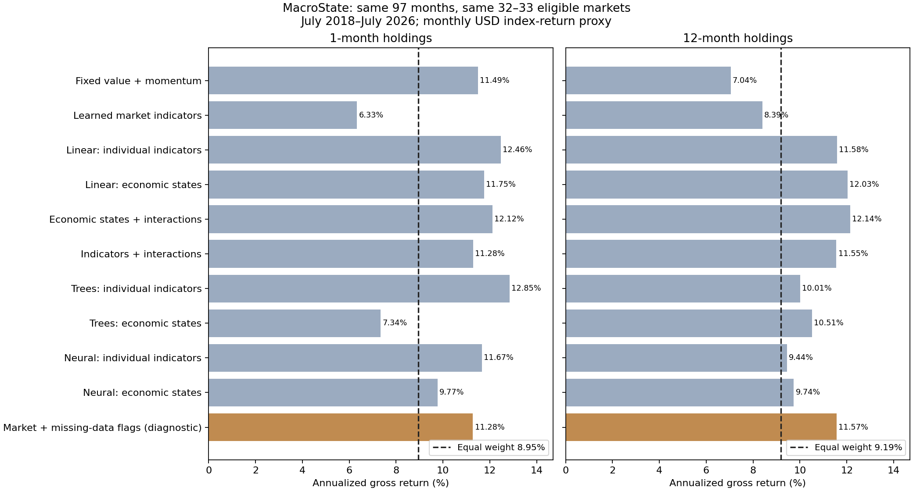
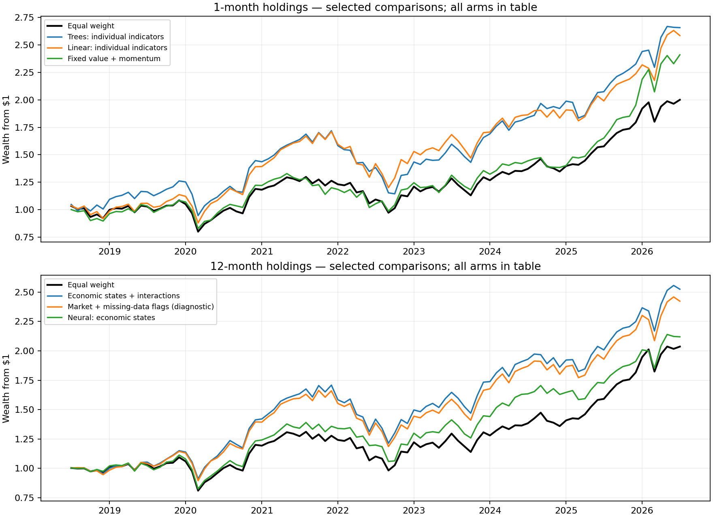

# MacroState: first model results

**Economic states plus two interactions lead the twelve-month comparison. Trees on individual indicators lead monthly rebalancing. The neural networks did not improve on those leaders.**

The annual result is heavily tied to persistent US holdings and data-availability patterns. Treat this as a useful historical selection result with a limited demonstrated macro contribution, not proof that the model learned broad country transmission.

## The results you asked for

July 2018–July 2026: 97 monthly forecasts, 32–33 eligible market tokens, seven selected each month. All arms use identical dates and eligible markets. These are gross USD total-return index comparisons; no costs or statistical-significance gate.

| Model | Monthly refreshed: annualized | Twelve-month holdings: annualized |
|---|---:|---:|
| Equal weight, same eligible markets | 8.95% | 9.19% |
| Fixed value + momentum | 11.49% | 7.04% |
| Learned market indicators | 6.33% | 8.39% |
| Linear: individual indicators | 12.46% | 11.58% |
| Linear: economic states | 11.75% | 12.03% |
| Economic states + interactions | 12.12% | 12.14% |
| Indicators + interactions | 11.28% | 11.55% |
| Trees: individual indicators | 12.85% | 10.01% |
| Trees: economic states | 7.34% | 10.51% |
| Neural: individual indicators | 11.67% | 9.44% |
| Neural: economic states | 9.77% | 9.74% |
| Market + missing-data flags (diagnostic) | 11.28% | 11.57% |

The broader equal-weight benchmark, including markets without the required macro coverage, returned **9.12%** and **9.32%** respectively. The previous Stage 1–2 baseline started in 2006; its numbers are not comparable to this shorter shared model sample.

## What the comparison says

- **Annual holdings:** states plus interactions returned 12.14%, against 9.19% equal weight, 7.04% fixed value/momentum, and 8.39% learned market-only. States without interactions returned 12.03%; the added terms made only a small difference.
- **Monthly refresh:** trees on individual indicators returned 12.85%, against 8.95% equal weight and 11.49% fixed value/momentum. Linear individual indicators returned 12.46%. Compressing inputs into states reduced this tree model’s monthly result to 7.34%.
- **Neural networks:** the fixed two-layer network returned 9.44%–9.74% with annual holdings and 9.77%–11.67% with monthly refresh. It did not beat the simpler leaders in this run. This is a result for these frozen settings, not a claim that neural networks can never help.

## The important diagnostic: why the annual result needs qualification

The annual state-plus-interactions model selected **NASDAQ, U.S., US SmallCap and Denmark in all 97 forecast months**. Every new seven-market sleeve therefore put 42.9% into the three US tokens and another 14.3% into Denmark. Holdings drifted after purchase. National macro identity was grouped during training, but the agreed investment universe and portfolio still contain three US market sleeves.

A control specified **after seeing that pattern** used only the three market inputs and eleven missing-data flags—none of the observed macro values. It returned **11.57%** with annual holdings. The economic-state leader adds only **0.57 percentage points/year** beyond that control. The individual-indicator linear model, at 11.58%, is almost identical to the missingness control.

This does not prove every gain is spurious. It shows that data availability can act as a country label and explain much of the apparent advantage over a market-only model. Earlier scores remain unchanged; the diagnostic is clearly recorded as a follow-up, not disguised as an untouched preplanned test.

For the annual state/interactions model, total active final wealth was approximately **$0.488 per initial $1**. The combined US contribution was **+$0.628**, while all other markets together contributed **−$0.139**. Twelve markets had positive active contributions. This is arithmetic attribution, not a rerun of a portfolio excluding the US.

The monthly individual-indicator tree result was broader: **20 markets** contributed positively, and active contribution remained positive after subtracting the largest macro identity’s contribution. That is worth distinguishing from the annual leader’s concentration; it is still attribution rather than an independently refitted no-US strategy.

## Drawdowns and consistency

| Comparison | Model max drawdown | Equal-weight max drawdown | Rolling 12M windows beating EW |
|---|---:|---:|---:|
| Economic states + interactions, 12M holdings | -28.98% | -25.94% | 67.4% |
| Trees: individual indicators, 1M holdings | -33.39% | -26.27% | 68.6% |
| Neural: economic states, 12M holdings | -25.91% | -25.94% | 67.4% |

Higher returns did not automatically mean lower risk. The annual leader lost 19.08% during 2022 against 11.12% for equal weight, and gained 20.81% in 2025 against 33.58%. It outperformed in five of seven complete calendar years (2019–2025). Rolling twelve-month win rates contain overlapping windows; they are descriptive consistency measures, not independent statistical trials.

## Exactly what ran

All learned models forecast twelve-month USD returns relative to the decision-eligible equal-weight universe. They begin after 60 matured monthly training origins, then refit every July on expanding history: nine refits, with monthly predictions between fits. No future twelve-month outcome was used before its maturity date. Training gives equal total weight to dates and macro identities, split among duplicate market sleeves.

The linear contest used a fixed ridge penalty of 1.0. State construction groups the same primitives into growth, inflation, policy tightness and financial stress. Missing components receive a training-mean neutral value inside the fitted design, with explicit flags shared by macro representations; raw input gaps remain missing in the snapshot. Three market controls are included in both representations. The two explicit nonlinear terms are cheapness × improving growth and weak growth × tighter policy; the model estimates their return coefficients.

The automatic nonlinear contest used shallow histogram gradient-boosted trees (200 iterations, at most seven leaves/depth three) and a small ReLU neural network with layers of 16 and 8 neurons (300 fixed epochs). Primitive and state versions had the same training opportunity. Neural training used one fixed random seed; all 18 neural fits reached the predeclared epoch budget and emitted the expected iteration-limit warning. Losses and warnings are saved. No convergence or seed-stability claim is made, and no settings were changed to improve returns.

The twelve-month portfolio starts with twelve equal cash sleeves and invests one each month; maturing sleeves recycle their own NAV and other holdings drift. The same convention applies to its benchmark. Excluding the eleven partially invested months, the state/interactions comparison annualizes at **14.11% versus 10.67%**. Monthly selection is a separate portfolio expression, not compounded overlapping annual labels.

## Evidence, reproducibility and boundaries

- [Stage 3 frozen protocol](stage3/protocol.json), [registration](stage3/registration.json), [scorecard](stage3/results/scorecard.csv), [predictions](stage3/results/predictions.csv), [yearly returns](stage3/results/calendar_returns.csv).
- [Nonlinear protocol](stage4/protocol.json), [registration](stage4/registration.json), [scorecard](stage4/results/scorecard.csv), [fit logs and warnings](stage4/results/fit_log.csv).
- [Post-result missingness protocol](stage5/protocol.json), [scorecard](stage5/results/scorecard.csv), [macro-value exclusion check](stage5/results/validation.json).
- [Combined scorecard](model_results/combined_scorecard.csv), per-country/identity contribution files in each results folder, and [model validation](MODEL_VALIDATION.json).

**36 automated tests and 15 end-to-end checks passed**, including repeatability of all saved linear/tree/neural forecasts, identical comparison rows, matured labels, real-data future-target perturbation, and identical benchmark calculations. The missingness diagnostic separately passes the same-sample and macro-value-invariance checks. Portfolio contribution reconciliation is asserted during every run.

Input histories remain conditional vendor-history reconstructions: fixed snapshots and causal code do not undo past vendor revisions. These are monthly index-return proxies, not executable next-session fills, and the universe is today’s configured market set. The nonlinear and missingness stages were designed after earlier results were seen, so this is a development sequence, not fresh confirmation. No production forecasting model, collection job or trading process was changed.

## What to pursue next

Keep **individual-indicator trees for monthly selection** and **the simple state model for annual holdings** as the two practical candidates. Do not expand the neural architecture based on this run. The next useful comparison is a US-exposure-matched benchmark and a clearly declared restriction on duplicate US sleeves, alongside the missingness control. That would show how much improvement remains after matching the persistent US allocation, rather than adding more model complexity.

The annual model passes the original results-first comparison but has a modest incremental edge over its missingness control. The monthly tree result combines stronger return improvement with broader contribution. Both remain research candidates, not automatic deployment choices.
