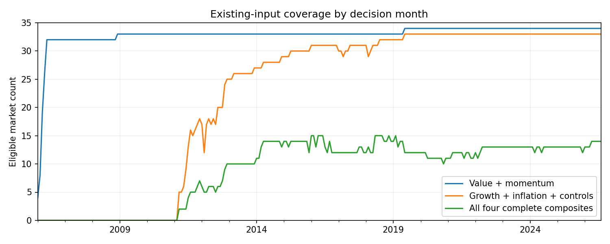
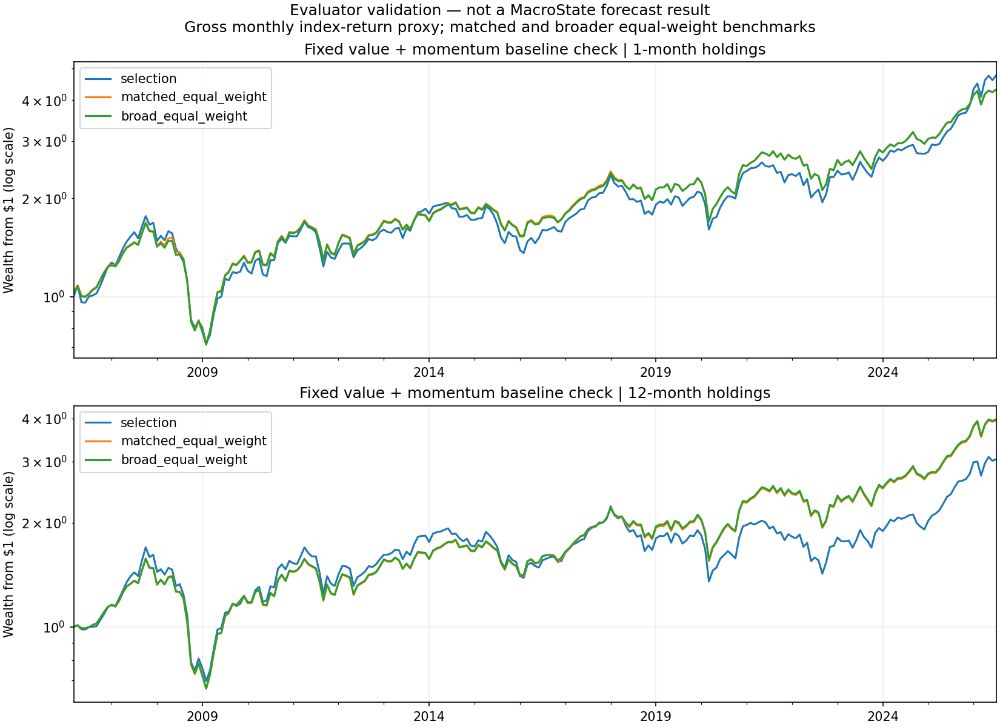

# MacroState: the inputs and evaluator are ready

**Completed 6 September 2026.** We now have a reproducible way to compare a top-20% country selection with equal weight. MacroState itself has not yet been fitted; the results below exercise the evaluator using the already specified simple value-and-momentum baseline.

## What changed after Arjun's direction

The question is practical: does the selection earn more than equal weight, with what drawdown and how consistently? There is **no statistical-significance gate**, no minimum t-statistic, no deflated-Sharpe hurdle, and no transaction-cost or turnover penalty. Existing production harness rules are unchanged. Date discipline, missing-data handling and correct arithmetic remain essential to interpreting the comparisons.

## Prepared existing inputs

Fourteen primitives are frozen from the existing Bloomberg monthly workbook, ECFC consensus histories, sovereign histories and FX-options histories:

| Group | Inputs |
|---|---|
| Growth | Blended GDP expectations; three-month revision in the same target-year forecasts |
| Inflation | Blended CPI expectations; three-month revision in the same target-year forecasts |
| Policy | 2Y yield; three-month change; 10Y minus 2Y slope |
| Stress | 5Y CDS; three-month CDS change; 1M FX implied volatility; three-month volatility change |
| Market controls | Cheapness from price/book; trailing 12-to-1-month total-return momentum; twelve-month return volatility |

Own-history transformations use only the previous 60 completed months, with at least 36 nonmissing observations. Inputs for month T come from observations available through the preceding completed month-end. Daily histories have an explicit ten-calendar-day maximum observation age; no further forward fill is added. Quarterly/annual latest-vintage macro fundamentals, current trade weights, projected demographics and future-return aliases are not imported as features.

The four candidate state composites are explicit and simple: the average of the two growth measures, the two inflation measures, 2Y level/change, and CDS/FX-volatility levels respectively, after past-only normalization. Both components must exist; otherwise the composite is missing. No singleton is presented as a complete composite. Raw primitives and component counts remain available for models with missing-data masks.

**Coverage determines the first model, not a statistical hurdle.** At the August 2026 decision origin (using July-end inputs), value/momentum covers all 34 market tokens; normalized growth/inflation plus controls cover 33. India is the missing market at this origin because the required current/next-year legs and sufficient recent normalized history are not available under the frozen rules; no other source or zero value is substituted. Requiring some policy and stress channels reduces coverage to 21. Requiring all four complete two-component composites reduces it to 14. There are 31 macro identities because the US and China have multiple market sleeves.

The first fit should therefore use the broad growth/inflation/control panel, preserve explicit missingness for optional policy/stress inputs, and show exact country coverage. It should not demand a complete four-block intersection or present a 14-market result as a 34-market result. A model's score-eligible benchmark and the broader market benchmark are both available.

The monthly raw workbook ends **31 July 2026**, despite newer daily macro files. The comparable return test stops at July; the August feature origin has no realized monthly outcome in this snapshot. Nothing has been extrapolated to September. All **10,555** comparable raw monthly returns match the previously frozen canonical return surface, with maximum absolute difference below 1 × 10⁻¹⁶.

## Portfolio evaluator exercised on real history

The fixed baseline is half cheap-price/book rank and half trailing-momentum rank, calculated afresh each month. It has no fitted parameters or searched settings. Eligible count grows from 19 to 34, so the selection contains four to seven markets. The input-coverage start rule is fixed at at least ten scored markets; the first qualifying month has nineteen. No date was chosen by profitability.

**March 2006–July 2026, gross monthly USD total-return index proxy:**

| Expression | Top 20% annualized | Matched equal weight annualized | Difference | Top 20% max drawdown | Equal-weight max drawdown |
|---|---:|---:|---:|---:|---:|
| Monthly refreshed value + momentum | 7.95% | 7.42% | +0.53 percentage points/year | −59.28% | −57.63% |
| Twelve-month staggered value + momentum | 5.61% | 6.95% | −1.34 percentage points/year | −58.87% | −57.87% |

The broader price-history benchmark, which also includes markets without available valuation, annualizes at 7.42% for monthly rebalancing and 6.99% for staggered holdings. Full details are in [baseline_demonstration.json](results/baseline_demonstration.json).

Monthly selection beat its matched benchmark in 50.9% of rolling twelve-month windows; the staggered expression did so in 39.3%. Active cumulative dollar contribution was positive for 12 and 10 markets respectively. Contributions reconcile exactly to selection-minus-benchmark final wealth; the CSVs expose individual names rather than implying that a large holdings count establishes broad gains.

The twelve-month expression starts with twelve equal cash sleeves earning zero. One sleeve invests each month; a maturing sleeve reinvests its own NAV after twelve months. Existing holdings drift with returns. The same convention applies to the benchmark. Excluding the eleven partially invested months, the annualized comparison is 5.08% versus 6.50%. This is separate from monthly portfolio rebalancing and does not compound overlapping annual labels as monthly profits.

**Interpretation:** the benchmark plumbing works and holding-period choice materially changes the observed result. These are not MacroState results, a promotion verdict, or evidence from a freshly untouched sample. No MacroState model has been fitted and no strategy-success claim has been submitted to a ledger.

## Validation performed

All **24 unit/canary tests and 14 real-data end-to-end checks passed**. Evidence: [validation.json](results/validation.json) and [tests.log](results/tests.log).

Checks cover seven-of-34 selection, deterministic ties, manual equal-weight arithmetic, first-loss drawdowns, twelve-month holding/ramp behavior, preserving held positions when eligibility changes, failing on missing held returns, missing calendar months, incomplete annual windows, label maturity, future-score invariance, source cutoff/age handling, consensus target-year blending, past-only normalization, real-data prefix invariance, and country-P&L reconciliation. Workbook ticker/field order is checked against the frozen collector manifest and its country mapping is taken from the frozen canonical builder.

The end-to-end run froze inputs, reconstructed the panel, produced the baseline selections and wealth series, generated charts, and reconciled outputs. The charts were visually inspected. No production DB connections were opened; no new packages or data feeds were installed.

## Remaining boundaries and next action

Vendor histories can be retrospectively corrected, and the collector itself may carry observations forward. We preserve a hashed snapshot and the raw workbook's missingness, but this does not recover unknowable original publication vintages. Historical outputs retain the label **conditional vendor-history reconstruction**. The universe is today’s configured 34 market tokens, not a reconstructed list of every historically investable market.

The current evaluator measures the monthly USD index-return expression. It does **not** claim executable prior-close fills, opening prices, or next-session trading performance. An executable-price comparison needs a separate use of the existing daily data with market calendars and a named price field. This is not necessary to calculate the requested index-level research comparison, but matters before trading interpretation.

**Next:** run the first bounded comparison of a shared flat model and a shared economic-state model on the frozen inputs, training only on fully known outcomes. Compare each model's top 20% with equal weight and with this fixed baseline on identical dates and eligibility; show both holding expressions. Judge returns, drawdowns, consistency and country contributions. Record the model specifications before running; do not reinstate significance gates or silently tune a winner. The existing methodology-registration pathway is for that forecasting stage, not a change made by this evaluator-only task.
